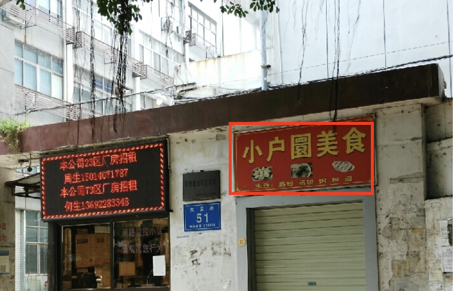

# JDet
本模块使用 JDet库 模型，在店面招牌文字识别任务中，将图片中的店面招牌的位置检测出来

## 示例
输入店面招牌图片：
<div style="text-align: center">

</div>

检测招牌的位置：
<div style="text-align: center">

</div>

### 1. 安装

以baseline代码位置为/project/train/src_repo/OCR-Baseline-main为例

编码环境执行
```shell
cd /project/train/src_repo/OCR-Baseline-main/JDet
sh install.sh
```

### 2. 数据集路径配置
以使用s2anet+ResNet50为例，在store_sign_detection/s2anet_r50_fpn_5x_ocr_630_1120_bs4.py中将dataset.train.dataset_dir、img_dir、gt_dir修改为数据集所处路径。

### 3. 训练

```python
cd /project/train/src_repo/OCR-Baseline-main/JDet
# 编码环境训练
sh coding_train.sh
# 训练环境训练
sh training_train.sh
```
### 4. 评估
在store_sign_detection/s2anet_r50_fpn_5x_ocr_630_1120_bs4.py文件最后一行加上resume_path="JDet.pkl"

执行评估：
```python
cd /project/train/src_repo/OCR-Baseline-main/JDet
# 编码环境评估
sh coding_eval.sh
# 训练环境评估
sh training_eval.sh
```
